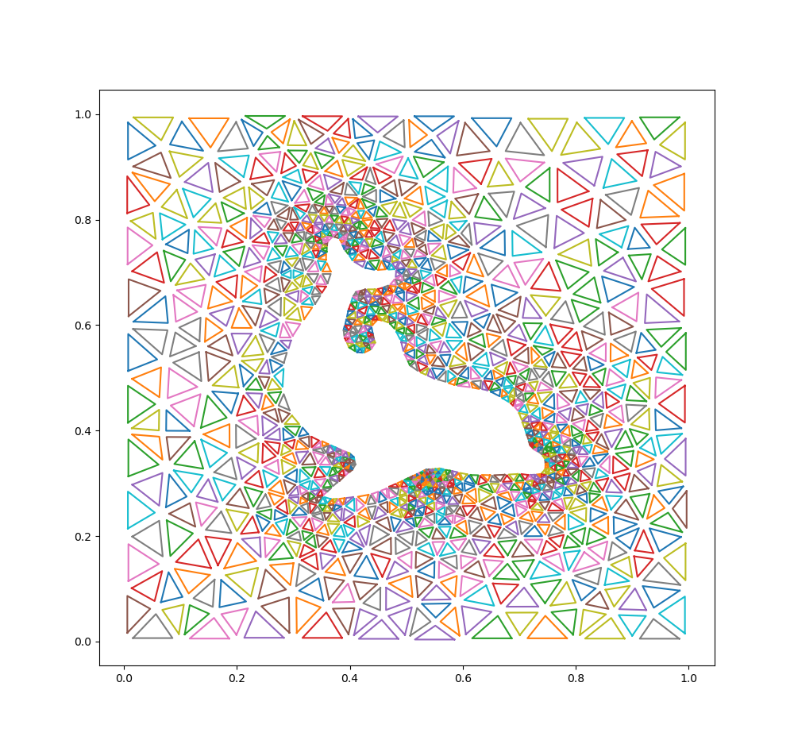

# 2D Integrals 🧮

Welcome to the **2D Integrals** project! This project focuses on numerical methods for evaluating two-dimensional integrals, a fundamental concept in computational physics and applied mathematics. 🌌

## Overview 📖

In this project, we focus on implementing an efficient algorithm for computing 2D integrals over various domains. The goal is to analyze the performance and accuracy of this method in solving integration problems. 📊

## Features ✨

- ✅ Implementation of a single numerical integration method.
- 📈 Analysis of the method's accuracy and performance.
- 🎨 Visualization of integration domains and results.

## Getting Started 🚀

1. Clone the repository:
    ```bash
    git clone <repository-url>
    ```
2. Navigate to the project directory:
    ```bash
    cd 2d-integrals
    ```
3. Follow the instructions in the `setup.md` file to install dependencies and run the code. 🛠️

## Visualization 🖼️



The above image represents a visualization related to the project. Replace it with your own relevant visualizations as needed. 🌊

## License 📜

This project is licensed under the GNU General Public License (GPL). See the `LICENSE` file for details. ⚖️
